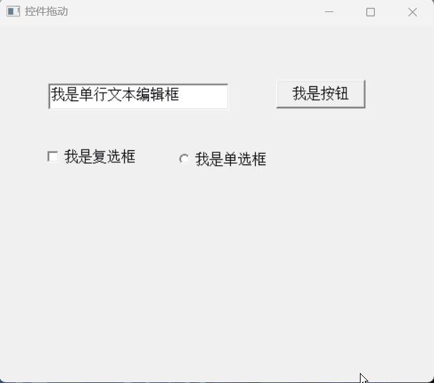

# pb-project-example

	

<h1 align="center" style="margin: 30px 0 30px; font-weight: bold;">pb-project-example</h1>
<h4 align="center">PB案例学习笔记</h4>

  
  
  
  
   
  
   

##  

如果项目您有所帮助，记得 Star ⭐关注哦，这对我是小凡非常不错的鼓励与支持。

别只点赞收藏哦，收藏≠学会，赶紧动起手敲起来吧。

重新开始最好的时间就是现在   *★,°*:.☆(￣▽￣)/$:*.°★* 。

-------

### 🐶 新手必读

​    如果您刚入坑PB，可以先看下小凡之前写的文章

- PB从入坑到放弃（一）第一个HelloWorld程序

​		https://mp.weixin.qq.com/s/WxBIiqW-HVNV9hHXerjJ0g

- PB从入坑到放弃（二）编码规范

  https://mp.weixin.qq.com/s/CGh6sPesFeVNDtOTOGS-EA

- PB从入坑到放弃（三）数据窗口

  https://mp.weixin.qq.com/s/8FXyLQu7MnIHesYufRtBFA

- PB从入坑到放弃（四）常用函数

  https://mp.weixin.qq.com/s/wdC9rl7RdSnu3_LO3r_u1g

- PB从入坑到放弃（五）窗口使用技巧

  https://mp.weixin.qq.com/s/FgE3wg_saZoL18fspU6MLA

- PB从入坑到放弃（六）动态SQL使用

​	  https://mp.weixin.qq.com/s/hkJ2tjJsiNPcmonTzSbrbA

- PB从入坑到放弃（七）PBer的福音来了

  https://mp.weixin.qq.com/s/C8-FQD5GMkj8jTpR0um_JA

### 🐤项目简介

通过一个个由浅入深的案例，带你入坑PB开发，掌握公司日常开发技巧

🐭 项目结构

| 项目名称                   | 项目描述                  |
| -------------------------- | ------------------------- |
| 01ApplicationWindowControl | 01创建应用、窗口与控件    |
| 02DirectoryBrowser         | 02目录浏览器              |
| 03PasswordAuthentication   | 03用户名密码校验          |
| 04FileBrowser              | 04文件浏览器              |
| 05PicBrowser               | 05图片浏览器              |
| 06DragIcon                 | 06图标移动                |
| 07FlashingText             | 07闪烁文字                |
| 08DragControl              | 08拖动控件                |
| 09ScrollBar                | 09滚动条使用              |
| 10ProgressBar              | 10进度条使用              |
| 11AnimationWindow          | 11动画显示窗口            |
| ... 博主正在玩命更新中...  | ... 博主正在玩命更新中... |

### 🐨 技术栈

- 开发语言：PowerScript 及第三方动态库
- 开发工具：PowerBuilder 9.0  补丁8836

##  

### 🐷 演示图

| biu                                                          | biu                                                          | biu                                |
| ------------------------------------------------------------ | ------------------------------------------------------------ | ---------------------------------- |
|  |  |  |
|                            |                        |  |
|                        |                            |  |
|                                                              |                                                              |                                    |
|                                                              |                                                              |                                    |
|                                                              |                                                              |                                    |
|                                                              |                                                              |                                    |
|                                                              |                                                              |                                    |
|                                                              |                                                              |                                    |

